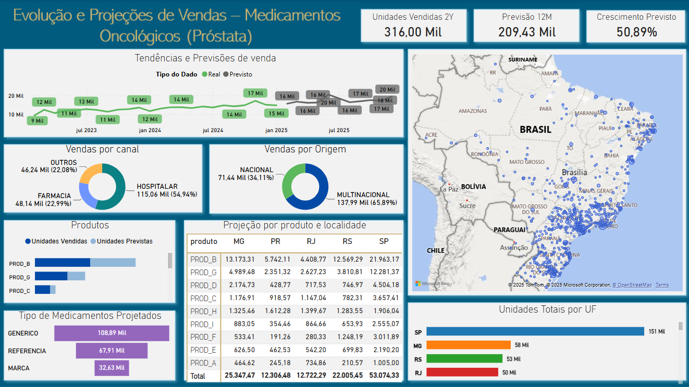

# Análise do Mercado de Medicamentos no Tratamento do Câncer de Próstata: Tendências e Previsões de venda

Este projeto tem como objetivo analisar tendências de mercado e prever a demanda futura de medicamentos utilizados no tratamento de câncer de próstata no Brasil, com foco em casos metastáticos. A análise foi realizada com dados dos últimos 24 meses e implementada em um pipeline de dados na nuvem utilizando a plataforma *Databricks Community Edition, juntamente com **Power BI* para visualizações interativas.

---

## 1. Objetivo

Analisar o mercado nacional de medicamentos para câncer de próstata com dados dos últimos 24 meses, aplicando técnicas de BI e previsão, e estruturando os dados para consumo analítico.

---

## 2. Pipeline de Dados

- *Bronze*: Ingestão dos arquivos brutos (CSV).
- *Silver*: Limpeza, transformação e estruturação em modelo dimensional (esquema estrela).
- *Gold*: Dados prontos para consumo analítico, incluindo previsões de vendas.

---

## 3. Modelagem Dimensional

O modelo segue um *esquema estrela*, com a seguinte estrutura:

### Tabela Fato:
- fato_vendas: Contém as métricas de vendas por período, local e produto.

### Tabelas Dimensão:
- dim_produto: Detalhes dos medicamentos.
- dim_local: Informações geográficas e canais de venda.

> Veja o diagrama de dados [Diagrama_Estrela](3_Screenshot_Diagrama_Estrela.jpg).

---

## 4. Previsões

Utilizou-se o modelo *GBTRegressor* para prever as vendas futuras (fev/2025 a dez/2025). Um ajuste manual foi feito para *jul/2025*, utilizando a média de jun e ago/2025, devido a um pico atípico identificado na projeção no Power BI.

---

## 5. Visualizações

As análises foram desenvolvidas no *Power BI* e incluem:

- Tendência histórica vs previsão
- Ranking por UF, cidade e canal
- Análise por tipo de medicamento
- Participação nacional vs internacional

---

## 6. Autoavaliação

As etapas foram concluídas com sucesso. Dificuldades enfrentadas envolveram:

- Implementação do modelo de previsão no ambiente limitado do Databricks Community
- Tratamento de anomalias nas projeções
- Exportação do arquivo final em CSV para Power BI

---

## 7. Documentos

| Nome do Arquivo | Descrição |
|------------------|------------|
| *[1_Analise_e_processos_realizados_documentação.pdf](1_Analise_e_processos_realizados_documentação.pdf)* | O documento completo com todas as respostas do MVP, justificativas técnicas, decisões de modelagem e print do projeto |
| *[2_Pipeline_de_Execução_Databricks_Community.ipynb](2_Pipeline_de_Execução_Databricks_Community.ipynb)* | Notebook com o pipeline de ingestão, transformação, modelagem e previsão implementado no Databricks |
| *[3_Screenshot_Diagrama_Estrela.jpg](3_Screenshot_Diagrama_Estrela.jpg)* | Imagem do diagrama de modelagem em esquema estrela |
| *[4_Arquivo_Desenvolvido_Power_BI.pbix](4_Arquivo_Desenvolvido_Power_BI.pbix)* | Arquivo com o dashboard final desenvolvido no Power BI |
| *[4_Screenshot_Dashboard_Power_BI.png](4_Screenshot_Dashboard_Power_BI.png)* | Captura de tela do dashboard final |
| *[Demanda_Medicamentos.csv](Demanda_Medicamentos.csv)* | Base de dados original fornecida pela IQVIA contendo informações de vendas mensais de medicamentos para o tratamento do câncer de próstata |
| *[README.md](README.md)* | Este arquivo com a descrição geral do projeto e instruções |

---

## 8. Tecnologias Utilizadas

- *Databricks Community Edition*
- *Apache Spark (PySpark)*
- *Power BI*
- *Python*
- *SQL*
- *CSV / DBFS*

---

## 9. Autora

Desenvolvido por Juliana Silva
